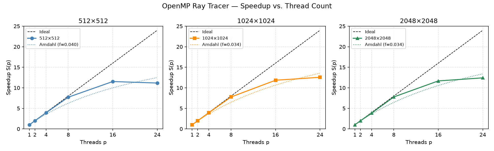

# OpenMP-parallelized 3D Ray Tracer

A simple ray tracer written in C++ that renders 3D scenes from ASCII STL files using the Möller–Trumbore intersection algorithm.

## Building

Compile all `.cpp` files together with your C++17 compiler and OpenMP:

```bash
g++ -std=c++17 -O2 -fopenmp src/triangle.cpp src/stl_loader.cpp main.cpp -o raytracer
```

On macOS with Apple Clang, replace `-fopenmp` with `-Xpreprocessor -fopenmp -lomp`
(requires `brew install libomp`).

The executable accepts optional width and height arguments: `./raytracer [width] [height]`

## Reference implementation

`given_example/SimpleRenderWithSTL.py` is the provided Python reference implementation.
It shows the complete rendering pipeline (camera setup, ray casting, diffuse shading,
PPM output) and was used as the specification for the C++ port.

## AI notice

The STL loader (`src/stl_loader.hpp` / `src/stl_loader.cpp`) was developed with the
assistance of an AI coding tool (Claude by Anthropic), as permitted by the
project guidelines.

We identified the triangle intersection loop in `Scene::trace` as a parallelization
candidate. Since we were unsure how to implement an OpenMP reduction over a custom
struct, we used AI assistance (Claude by Anthropic) to figure out the syntax and
approach. The implementation was done by us.

However, benchmarking revealed that parallelizing `Scene::trace` with OpenMP is
counterproductive for typical scene sizes. With a 358-triangle STL file and 100,000
trace calls, the results were:

| | Time |
|---|---|
| Without OMP | 212 ms (2.13 µs/trace) |
| With OMP | 1387 ms (13.87 µs/trace) |

The thread management and reduction synchronization overhead outweighs the benefit
at this triangle count. OMP in `trace` would only pay off for scenes with significantly
more triangles. The parallelization was therefore removed from `Scene::trace` and
applied at the render loop level instead (one thread per pixel).

## Correctness verification

The parallel version was verified by running both p=1 and p=16 on the same input and
comparing the PPM output byte-for-byte — files are identical, since each pixel writes to
a distinct index with no shared mutable state.

## Render benchmark (Aufgabe 7.2)

Measured on an AMD Ryzen 9 7900 (12 cores / 24 threads, 2×SMT).
Scene: `given_example/test.stl` (358 triangles).
Timing covers only the render loop (STL loading, PPM output and PNG conversion excluded).
Each entry is the median of 3 runs.

### a) Runtimes T(p)

#### 512 × 512

| p  | T(p) [ms] |
|----|----------:|
|  1 |     567.2 |
|  2 |     285.9 |
|  4 |     144.4 |
|  8 |      73.5 |
| 16 |      49.2 |
| 24 |      50.8 |

#### 1024 × 1024

| p  | T(p) [ms] |
|----|----------:|
|  1 |    2223.8 |
|  2 |    1121.0 |
|  4 |     564.4 |
|  8 |     286.4 |
| 16 |     187.8 |
| 24 |     177.1 |

#### 2048 × 2048

| p  | T(p) [ms] |
|----|----------:|
|  1 |    8869.6 |
|  2 |    4467.7 |
|  4 |    2306.6 |
|  8 |    1140.3 |
| 16 |     759.6 |
| 24 |     713.9 |

### b) Speedup S(p) = T(1)/T(p) and Efficiency E(p) = S(p)/p

#### 512 × 512

| p  | T(p) [ms] |  S(p) |  E(p) |
|----|----------:|------:|------:|
|  1 |     567.2 | 1.000 | 1.000 |
|  2 |     285.9 | 1.984 | 0.992 |
|  4 |     144.4 | 3.928 | 0.982 |
|  8 |      73.5 | 7.717 | 0.965 |
| 16 |      49.2 |11.528 | 0.721 |
| 24 |      50.8 |11.165 | 0.465 |

#### 1024 × 1024

| p  | T(p) [ms] |  S(p) |  E(p) |
|----|----------:|------:|------:|
|  1 |    2223.8 | 1.000 | 1.000 |
|  2 |    1121.0 | 1.984 | 0.992 |
|  4 |     564.4 | 3.940 | 0.985 |
|  8 |     286.4 | 7.765 | 0.971 |
| 16 |     187.8 |11.841 | 0.740 |
| 24 |     177.1 |12.557 | 0.523 |

#### 2048 × 2048

| p  | T(p) [ms] |  S(p) |  E(p) |
|----|----------:|------:|------:|
|  1 |    8869.6 | 1.000 | 1.000 |
|  2 |    4467.7 | 1.985 | 0.993 |
|  4 |    2306.6 | 3.845 | 0.961 |
|  8 |    1140.3 | 7.778 | 0.972 |
| 16 |     759.6 |11.677 | 0.730 |
| 24 |     713.9 |12.424 | 0.518 |

### c) Speedup plot and discussion



Up to p = 8 (one thread per physical core) the measured speedup tracks the ideal line
closely — the render loop is embarrassingly parallel with no synchronization overhead.
Beyond p = 8 the curve flattens. Two effects account for this:

1. **SMT saturation**: threads 9–24 share physical cores and compete for the same FPUs,
   so per-core floating-point throughput does not double again.
2. **Memory bandwidth**: at larger resolutions the pixel buffer no longer fits in L3 cache
   and write bandwidth becomes the bottleneck.

The plateau is reached earlier for 512×512 than for 2048×2048 because the smaller
workload's thread-scheduling overhead is relatively larger.

### d) Amdahl's law fit

Fitting `S(p) = 1 / (f + (1 − f)/p)` to the measured speedup data:

| Resolution  | f (serial fraction) | S_max = 1/f |
|-------------|--------------------:|------------:|
| 512 × 512   |              0.0401 |       ~24.9 |
| 1024 × 1024 |              0.0335 |       ~29.8 |
| 2048 × 2048 |              0.0344 |       ~29.1 |

The estimated serial fraction is around 3–4 %. This corresponds to thread-startup
overhead inside the parallel region and the minor sequential parts of the render function
(camera setup, buffer allocation). The theoretical S_max of ~25–30 is never reached in
practice because the hardware limit of 12 physical cores (24 logical with SMT) caps the
achievable speedup at around 12× before Amdahl's ceiling is relevant.
